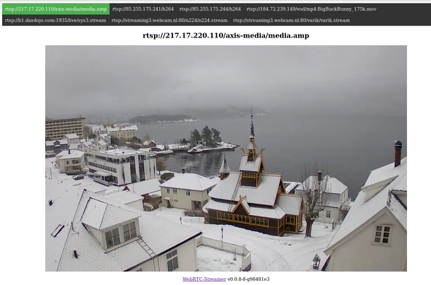
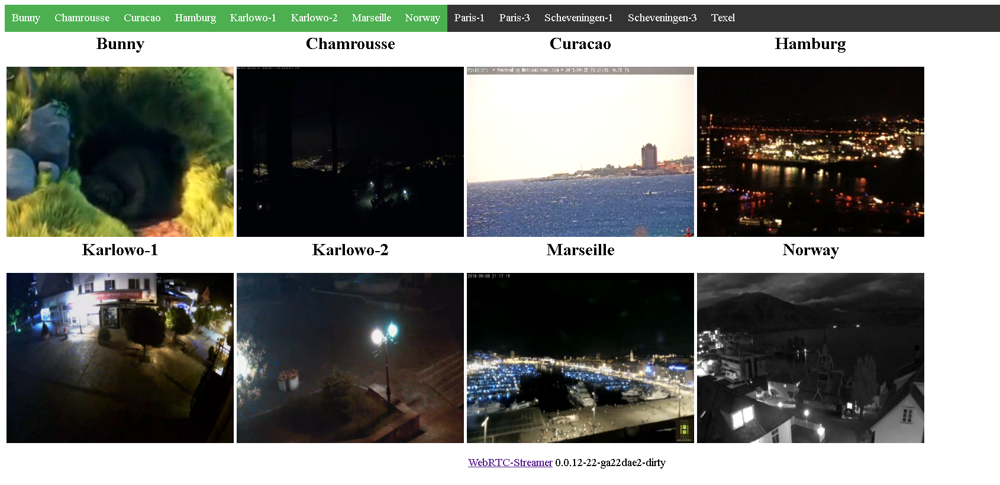
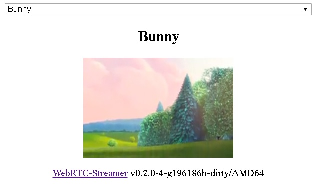
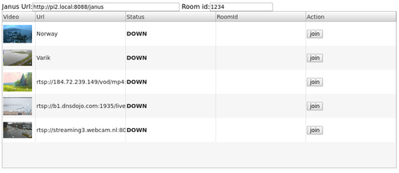

WebRTC-streamer
===============

WebRTC-streamer is an experiment to stream video capture devices and RTSP sources through WebRTC using simple mechanism.  

It embeds a HTTP server that implements API and serves a simple HTML page that use them through AJAX.   

The WebRTC signaling is implemented through HTTP requests:

 - /api/call   : send offer and get answer
 - /api/hangup : close a call

 - /api/addIceCandidate : add a candidate
 - /api/getIceCandidate : get the list of candidates

The list of HTTP API is available using /api/help.

Nowdays there is 3 builds on [CircleCI](https://circleci.com/gh/mpromonet/webrtc-streamer) :
 * for x86_64 on Ubuntu Bionic
 * for armv7 crosscompiling with gcc-linaro-arm-linux-gnueabihf-raspbian-x64 (this build is running on Raspberry Pi2 and NanoPi NEO)
 * for armv6+vfp crosscompiling with gcc-linaro-arm-linux-gnueabihf-raspbian-x64 (this build is running on Raspberry PiB and should run on a Raspberry Zero)
 
and 4 builds on [Appveyor](https://ci.appveyor.com/project/mpromonet/webrtc-streamer) :
* for Windows using Visual 2017 64bits Release/Debug
* for x86_64 Ubuntu Xenial Release/Debug

The webrtc stream name could be :
 * an alias defined using -n argument then the corresponding -u argument will be used to create the capturer
 * an "rtsp://" url that will be openned using an RTSP capturer based on live555
 * an "file://" url that will be openned using an MKV capturer based on live555
 * an "screen://" url that will be openned by webrtc::DesktopCapturer::CreateScreenCapturer 
 * an "window://" url that will be openned by webrtc::DesktopCapturer::CreateWindowCapturer 
 * a V4L2 capture device name

Dependencies :
-------------
It is based on :
 * [WebRTC Native Code Package](http://www.webrtc.org) for WebRTC
 * [civetweb HTTP server](https://github.com/civetweb/civetweb) for HTTP server
 * [live555](http://www.live555.com/liveMedia) for RTSP/MKV source

Build
===============
Install the Chromium depot tools (for WebRTC).
-------
	pushd ..
	git clone https://chromium.googlesource.com/chromium/tools/depot_tools.git
	export PATH=$PATH:`realpath depot_tools`
	popd

Download WebRTC 
-------
	mkdir ../webrtc
	pushd ../webrtc
	fetch --no-history webrtc 
	popd
	

Build WebRTC Streamer
-------
	cmake . -DWEBRTCBUILD=<Release or Debug> -DWEBRTCROOT=<path to WebRTC>
	make

where WEBRTCROOT and WEBRTCBUILD indicate how to point to WebRTC :
 - $WEBRTCROOT/src should contains source (default is $(pwd)/../webrtc) 
 - $WEBRTCROOT/src/out/$WEBRTCBUILD should contains libraries (default is Release)

Usage
===============
	./webrtc-streamer [-H http port] [-S[embeded stun address]] -[v[v]]  [url1]...[urln]
	./webrtc-streamer [-H http port] [-s[external stun address]] -[v[v]] [url1]...[urln]
	./webrtc-streamer -V
        	-v[v[v]]           : verbosity
        	-V                 : print version

        	-H [hostname:]port : HTTP server binding (default 0.0.0.0:8000)
		-w webroot         : path to get files
		-c sslkeycert      : path to private key and certificate for HTTPS
		-T nbthreads       : number of threads for HTTP server
		-A passwd          : password file for HTTP server access
		-D authDomain      : authentication domain for HTTP server access (default:mydomain.com)

         	-S[stun_address]   : start embeded STUN server bind to address (default 0.0.0.0:3478)
         	-s[stun_address]   : use an external STUN server (default stun.l.google.com:19302)
         	-t[username:password@]turn_address : use an external TURN relay server (default disabled)		
        	-a[audio layer]    : spefify audio capture layer to use (default:3)		

		-n name -u videourl -U audiourl : register a name for a video url and an audio url
         	[url]                           : url to register in the source list
		-C config.json                  : load urls from JSON config file 

Arguments of '-H' are forwarded to option [listening_ports](https://github.com/civetweb/civetweb/blob/master/docs/UserManual.md#listening_ports-8080) of civetweb, then it is possible to use the civetweb syntax like `-H8000,9000` or `-H8080r,8443s`.

Example
-----
	webrtc-streamer rtsp://217.17.220.110/axis-media/media.amp \
				rtsp://85.255.175.241/h264 \
				rtsp://85.255.175.244/h264 \
				rtsp://184.72.239.149/vod/mp4:BigBuckBunny_175k.mov

[Live Demo](https://webrtc-streamer.herokuapp.com/)

We can access to the WebRTC stream using [webrtcstreamer.html](https://github.com/mpromonet/webrtc-streamer-html/blob/master/webrtcstreamer.html) for instance :

 * https://webrtc-streamer.herokuapp.com/webrtcstreamer.html?rtsp://217.17.220.110/axis-media/media.amp
 * https://webrtc-streamer.herokuapp.com/webrtcstreamer.html?Bunny

An example displaying grid of WebRTC Streams is available using option "layout=<lines>x<columns>"

[Live Demo](https://webrtc-streamer.herokuapp.com/?layout=2x4)

Embed in a HTML page:
===============
Instead of using the internal HTTP server, it is easy to display a WebRTC stream in a HTML page served by another HTTP server. The URL of the webrtc-streamer to use should be given creating the [WebRtcStreamer](http://htmlpreview.github.io/?https://github.com/mpromonet/webrtc-streamer-html/blob/master/jsdoc/WebRtcStreamer.html) instance :

	var webRtcServer      = new WebRtcStreamer(<video tag>, <webrtc-streamer url>);

A short sample HTML page using webrtc-streamer running locally on port 8000 :

	<html>
	<head>
	
	
	
	
	</head>
	<body> 
	    <video id="video" />
	</body>
	</html>

Using WebComponent
==================
Using web-component could be a simple way to display some webrtc stream, a minimal page could be :

	<html>
	<head>
           
           
	</head>
	<body>
	   <webrtc-streamer videostream="Bunny"></webrtc-streamer>
	</body>
	</html>

[Live Demo](https://webrtc-streamer.herokuapp.com/Bunny.html)  

Using the webcomponent with a stream selector :

[Live Demo](https://webrtc-streamer.herokuapp.com/webrtc-streamer-element.html)

Using the webcomponent over google map :

[Live Demo](https://webrtc-streamer.herokuapp.com/map.html)

Connect to Janus Gateway Video Room
===============
A simple way to publish WebRTC stream to a [Janus Gateway](https://janus.conf.meetecho.com) Video Room is to use the [JanusVideoRoom](http://htmlpreview.github.io/?https://github.com/mpromonet/webrtc-streamer-html/blob/master/jsdoc/JanusVideoRoom.html) interface

        var janus = new JanusVideoRoom(<janus url>, <webrtc-streamer url>)

A short sample to publish WebRTC streams to Janus Video Room could be :

	<html>
	<head>
	
	
	
	</head>
	</html>

[Live Demo](https://webrtc-streamer.herokuapp.com/janusvideoroom.html)

This way the communication between [Janus API](https://janus.conf.meetecho.com/docs/JS.html) and [WebRTC Streamer API](https://webrtc-streamer.herokuapp.com/help) is implemented in Javascript running in browser.

The same logic could be implemented in NodeJS using the same JS API :

	global.request = require('then-request');
	var JanusVideoRoom = require('./html/janusvideoroom.js'); 
	var janus = new JanusVideoRoom("http://192.168.0.15:8088/janus", "http://192.168.0.15:8000")
	janus.join(1234,"mmal service 16.1","video")

Connect to Jitsi 
===============
A simple way to publish WebRTC stream to a [Jitsi](https://meet.jit.si) Video Room is to use the [XMPPVideoRoom](http://htmlpreview.github.io/?https://github.com/mpromonet/webrtc-streamer-html/blob/master/jsdoc/XMPPVideoRoom.html) interface

        var xmpp = new XMPPVideoRoom(<xmpp server url>, <webrtc-streamer url>)

A short sample to publish WebRTC streams to a Jitsi Video Room could be :

	<html>
	<head>
	
	
	
	
	
	
	
	
	</head>
	</html>

[Live Demo](https://webrtc-streamer.herokuapp.com/xmppvideoroom.html)

Docker image
===============
You can start the application using the docker image :

        docker run -p 8000:8000 -it mpromonet/webrtc-streamer

You can expose V4L2 devices from your host using :

        docker run --device=/dev/video0 -p 8000:8000 -it mpromonet/webrtc-streamer

The container entry point is the webrtc-streamer application, then you can :

* get the help using :

        docker run -p 8000:8000 -it mpromonet/webrtc-streamer -h

* run the container registering a RTSP url using :

        docker run -p 8000:8000 -it mpromonet/webrtc-streamer -n raspicam -u rtsp://pi2.local:8554/unicast

* run the container giving config.json file using :

        docker run -p 8000:8000 -v $PWD/config.json:/app/config.json mpromonet/webrtc-streamer

